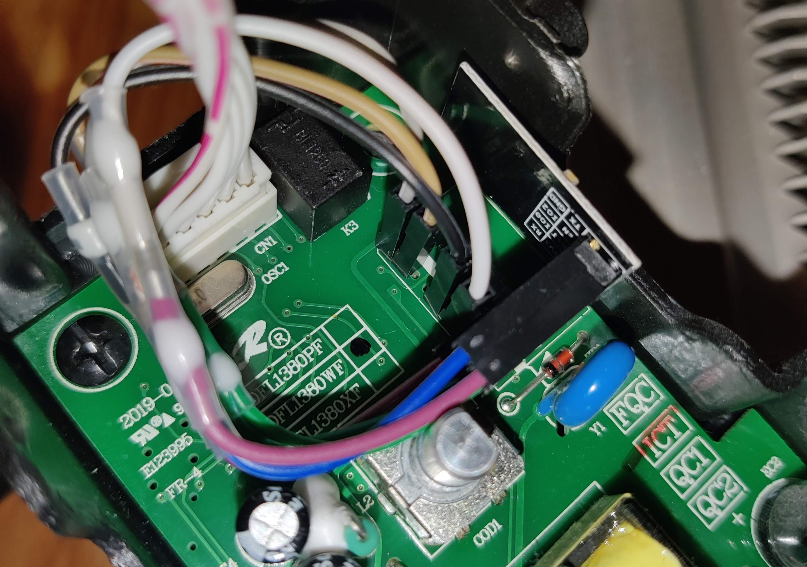

# MillHeat-ESPHome
A quick guide to replacing the HF-LPT120 V1 WiFi chip in the Mill Convection Heater (Gen2) with and ESP01 (or any other esp8266/esp32)

Based on the initial work found in [JDolven/Replacing-HF_LPT120A-in-a-millheat-heater](https://github.com/JDolven/Replacing-HF_LPT120A-in-a-millheat-heater/)

This repo contains additional functionality such as specifying the uart device, fan mode and climate actions

# Install

To be able to send commands on the TX pin, we must remove the existing HF-LP120 chip as it is holing the TX pin high (so that we cannot send data).

Here are the pin connections:
- PIN1 - GND
- PIN2 - 3v3 + EN
- PIN5 - RX
- PIN6 - TX
- PIN7 - GPIO02

Notice that pin 2 is connected to 3v3 and the EN pin so that the esp01 can boot. This will not be needed for other devices such as the nodemcu.

We need GPIO02 to be set to high. I assume this is how the HF chip could communicate that it was online. I tried running it without this pin and it would stop working after a couple of minutes/hours.
I presume it didnt fail instantly as the voltage may have been floating when it was diconnected.



## Debug:

Here are some of the outputs that the LP120 would send when using the mill app to set different settings:
```
SET 14 DEGREES
0x5a 0x00 0x10 0x1b 0x00 0x46 0x01 0x00 0x0e 0x00 0x00 0x00 0x00 0x00 0x80 0x5b 
0x5a 0x00 0x10 0x1c 0x00 0x50 0x00 0x00 0x00 0x00 0x00 0x00 0x00 0x00 0x7c 0x5b

SET 5 DEGREES
0x5a 0x00 0x10 0x1d 0x00 0x46 0x01 0x00 0x05 0x00 0x00 0x00 0x00 0x00 0x79 0x5b 
0x5a 0x00 0x10 0x1e 0x00 0x50 0x00 0x00 0x00 0x00 0x00 0x00 0x00 0x00 0x7e 0x5b

SET OFF
0x5a 0x00 0x10 0x1f 0x00 0x44 0x00 0x00 0x00 0x00 0x00 0x00 0x00 0x00 0x73 0x5b

SET ON
0x5a 0x00 0x10 0x20 0x00 0x44 0x01 0x00 0x00 0x00 0x00 0x00 0x00 0x00 0x75 0x5b 

SET 6 DEGREES
0x5a 0x00 0x10 0x22 0x00 0x46 0x01 0x00 0x06 0x00 0x00 0x00 0x00 0x00 0x7f 0x5b 
0x5a 0x00 0x10 0x23 0x00 0x50 0x00 0x00 0x00 0x00 0x00 0x00 0x00 0x00 0x83 0x5b 

FAN OFF
0x5a 0x00 0x10 0x26 0x00 0x48 0x00 0x00 0x00 0x00 0x00 0x00 0x00 0x00 0x7e 0x5b

FAN ON
0x5a 0x00 0x10 0x27 0x00 0x48 0x01 0x00 0x00 0x00 0x00 0x00 0x00 0x00 0x80 0x5b
```
